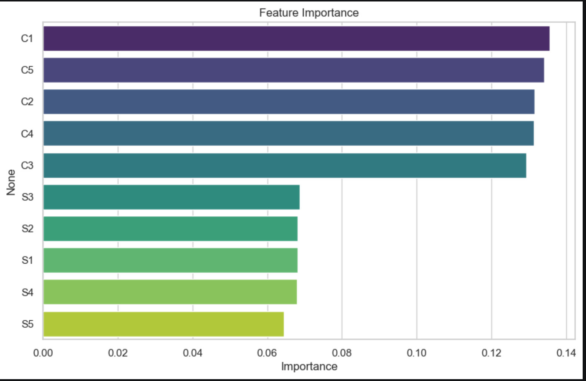
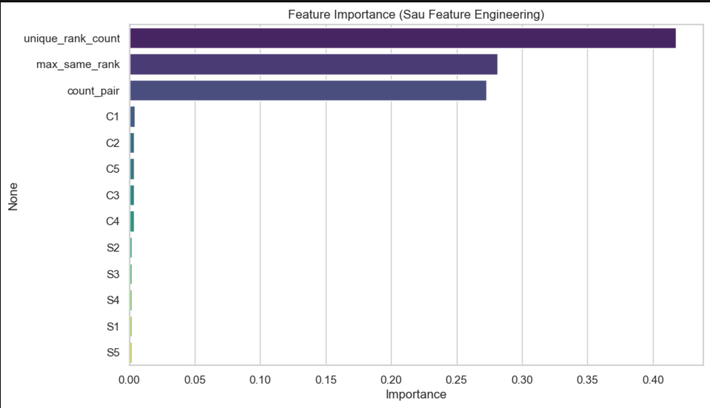
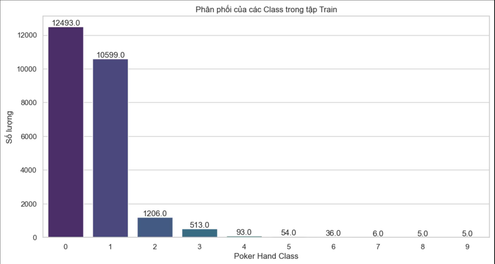
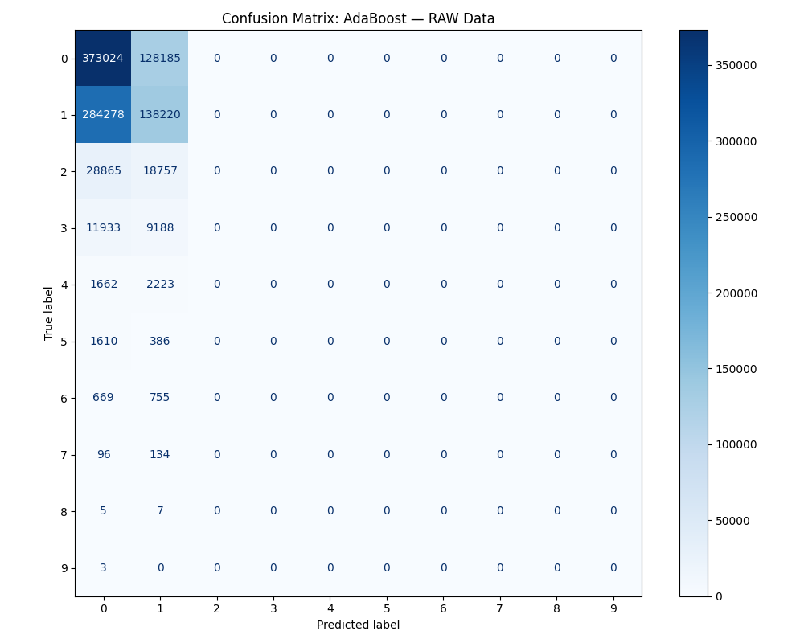
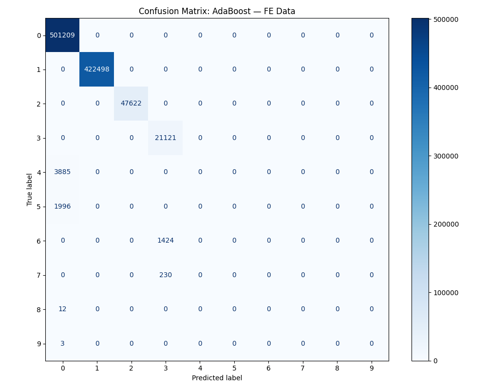
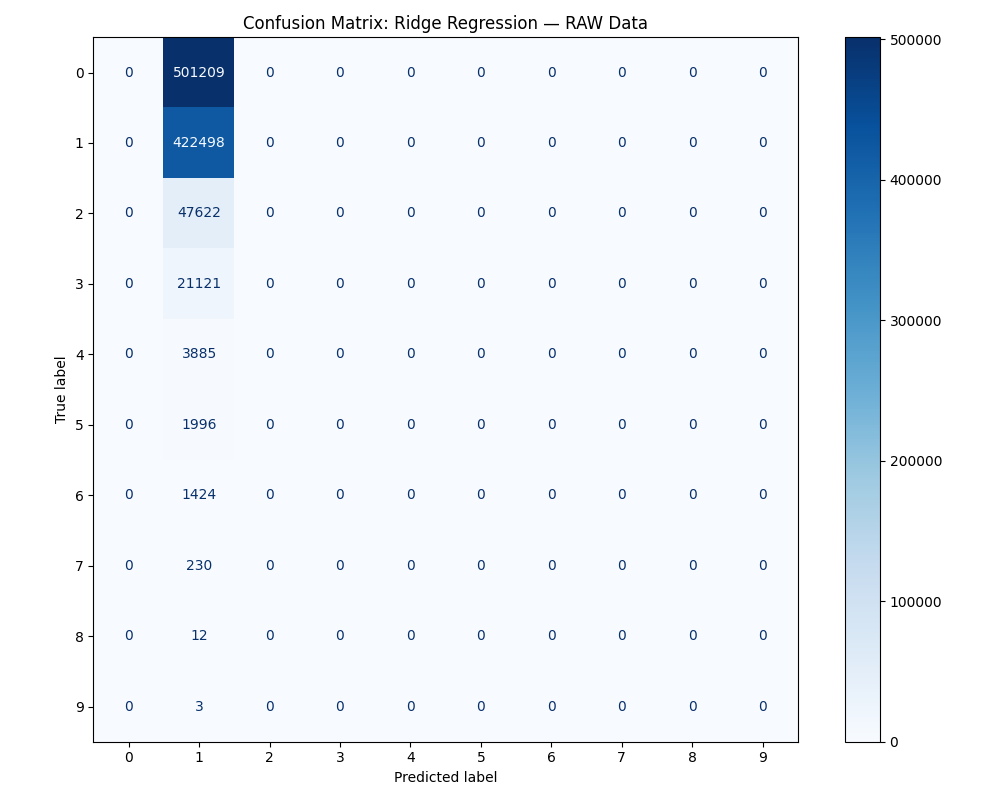
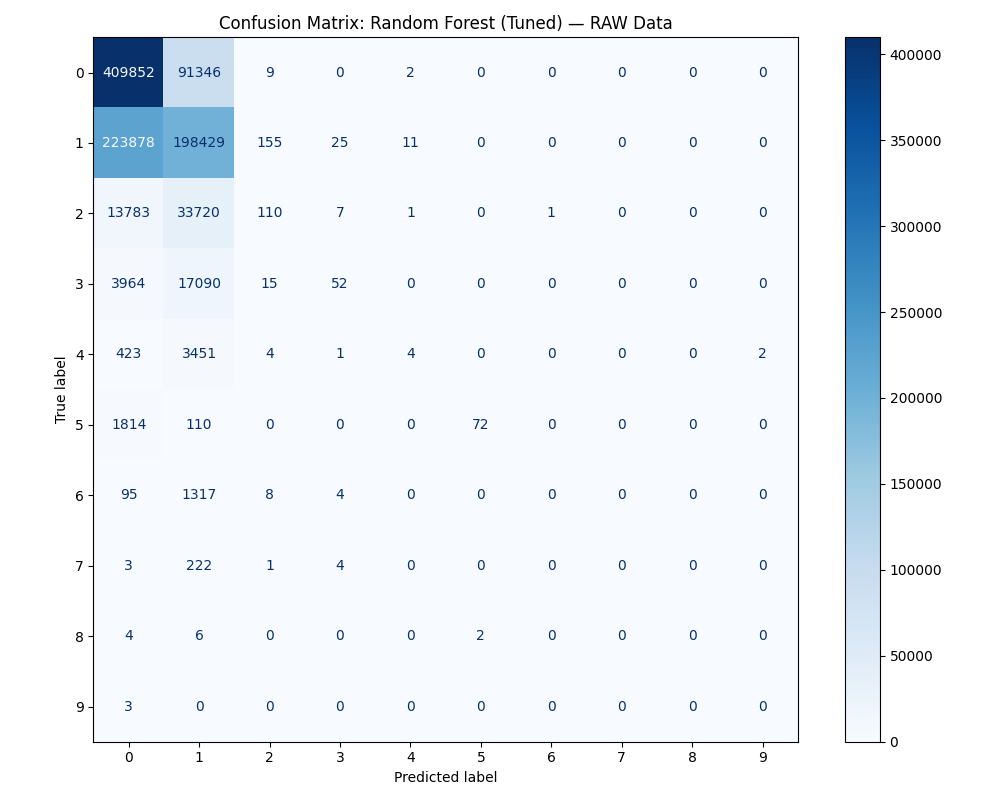
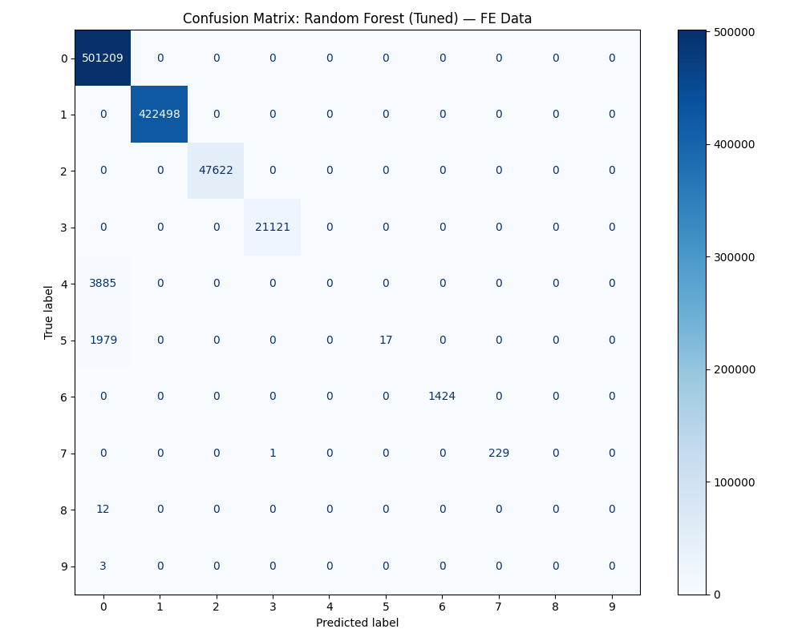
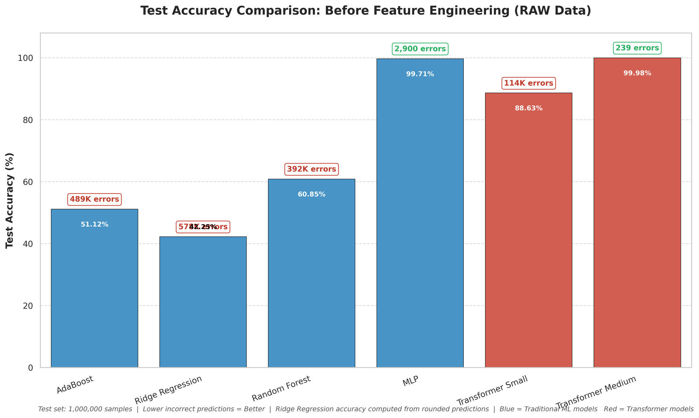
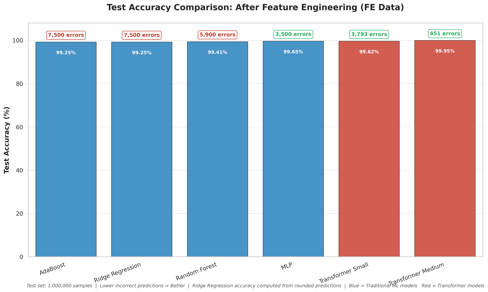

# Poker Hand Prediction

## 1. Giới thiệu dự án (Project Overview)
Dự án **Poker Hand Prediction** giải quyết bài toán phân loại đa lớp (Multi-class Classification) dựa trên bộ dữ liệu Poker Hand. Mục tiêu của bài toán là dự đoán phân loại tay bài Poker (từ 0 đến 9) dựa trên 5 lá bài được rút ra từ một bộ bài tiêu chuẩn 52 lá.

## 2. Thông tin Dữ liệu (Data Description)
Mỗi mẫu dữ liệu (sample) đại diện cho một tay bài gồm 5 lá bài.
- **RAW Data (Dữ liệu thô):** Bao gồm 10 đặc trưng (features) đại diện cho 5 lá bài. Mỗi lá bài được mô tả bởi 2 đặc trưng: Chất (Suit - ký hiệu S1 đến S5, giá trị từ 1-4) và Thứ hạng (Rank/Card - ký hiệu C1 đến C5, giá trị từ 1-13).
- **FE Data (Dữ liệu đã Feature Engineering):** Dữ liệu được bổ sung thêm các đặc trưng thủ công (hand-crafted features) được tính toán từ các lá bài như: số lượng rank duy nhất (unique ranks), rank xuất hiện nhiều lần nhất (max same rank), đếm số lượng cặp (count pair), v.v. để giúp các mô hình truyền thống dễ học hơn.
- **Tập Train:** 25,010 mẫu.
- **Tập Test:** 1,000,000 mẫu.

**Phân tích độ quan trọng của đặc trưng (Feature Importance):**

> **Phân tích:** Trên dữ liệu RAW, các đặc trưng về thứ hạng của lá bài (C1 đến C5) chiếm độ quan trọng cao nhất (mỗi thuộc tính khoảng 13-14%). Ngược lại, chất của lá bài (S1 đến S5) ít quan trọng hơn (khoảng 6-7%). Điều này hoàn toàn hợp lý vì luật Poker chủ yếu dựa vào các tổ hợp giá trị bài (pair, straight) nhiều hơn là đồng chất (flush).

> **Phân tích:** Sau khi thực hiện Feature Engineering, các đặc trưng mới được tạo ra chi phối hoàn toàn quá trình ra quyết định. Thuộc tính `unique_rank_count` (số lượng thứ hạng duy nhất) chiếm tới hơn 40% tầm quan trọng, tiếp theo là `max_same_rank` (khoảng 28%) và `count_pair` (khoảng 27%). Các đặc trưng thô ban đầu (C và S) gần như bị đẩy về 0. Điều này cho thấy FE đã cung cấp những "lối tắt" cực kỳ hiệu quả để các mô hình truyền thống phân loại bài.

## 3. Phân phối dữ liệu (Data Imbalance)
Một trong những thách thức cực lớn của bộ dữ liệu này là **sự mất cân bằng dữ liệu trầm trọng (Highly Imbalanced Data)**.

> **Phân tích phân phối:** Biểu đồ trên cho thấy tập Train bị mất cân bằng cực đoan. 
> - **Class 0 (Nothing in hand)** có 12,493 mẫu và **Class 1 (One pair)** có 10,599 mẫu, chiếm đại đa số (hơn 90% tổng số mẫu).
> - Các class trung bình như **Class 2 (Two pairs)** (1,206 mẫu) hay **Class 3 (Three of a kind)** (513 mẫu) xuất hiện thưa thớt.
> - Các class cao cấp như **Class 8 (Straight flush)** hay **Class 9 (Royal flush)** là vô cùng hiếm gặp (chỉ có 5 mẫu cho mỗi class).
> Sự mất cân bằng này khiến cho các mô hình học máy truyền thống cực kỳ dễ bị "thiên lệch" (bias) về các class 0 và 1, và gần như sẽ bỏ qua hoàn toàn các class hiếm (như 8 và 9) nếu không có thuật toán xử lý phù hợp.

## 4. Hiệu suất của các mô hình học máy truyền thống (Model Performance)
Các mô hình truyền thống đã được tinh chỉnh siêu tham số (Hyperparameter Tuning) sử dụng **GridSearchCV** kết hợp **Cross-Validation**. 

### 4.1. AdaBoost
- **RAW Data (Runtime: ~48s)**
  - Best Parameters: `{'clf__estimator__max_depth': 2, 'clf__learning_rate': 0.1, 'clf__n_estimators': 50}`
  - Test Accuracy: `51.12%` (Incorrect Predictions: `488,800 / 1,000,000`)
  
  > **Phân tích Confusion Matrix:** Trên dữ liệu RAW, AdaBoost gần như chỉ đoán đúng Class 0 và Class 1, hoàn toàn thất bại ở các Class từ 2 trở đi. Mô hình bị overfit vào majority classes.

- **FE Data (Runtime: ~48s)**
  - Best Parameters: `{'clf__estimator__max_depth': 2, 'clf__learning_rate': 0.1, 'clf__n_estimators': 50}`
  - Test Accuracy: `99.25%` (Incorrect Predictions: `7,500 / 1,000,000`)
  
  > **Phân tích Confusion Matrix:** Nhờ các đặc trưng FE, đường chéo chính rõ nét rực rỡ, số lượng dự đoán sai giảm đột ngột từ 488,800 xuống chỉ còn 7,500.

### 4.2. Ridge Regression
- **RAW Data (Runtime: ~45s)**
  - Best Parameters: `{'alpha': 10.0, 'fit_intercept': True}`
  - Test Accuracy (Rounded): `42.25%` (Incorrect Predictions: `577,500 / 1,000,000`)
  
  > **Phân tích:** Hồi quy tuyến tính có hiệu suất thấp nhất (chỉ 42.25%) do bản chất bài toán là phân loại đa lớp không có quan hệ tuyến tính giữa các giá trị lá bài và các tổ hợp Poker Hand.

- **FE Data (Runtime: ~45s)**
  - Best Parameters: `{'alpha': 0.1, 'fit_intercept': True}`
  - Test Accuracy (Rounded): `99.25%` (Incorrect Predictions: `7,500 / 1,000,000`)
  
  > **Phân tích:** Ngay cả một mô hình đơn giản như Ridge Regression cũng đạt được 99.25% khi có các đặc trưng tốt, chứng tỏ FE là mấu chốt của Machine Learning truyền thống.

### 4.3. Random Forest (Tuned)
- **RAW Data (Runtime: ~2 phút)**
  - Best Parameters: `{'max_depth': 20, 'min_samples_leaf': 1, 'n_estimators': 300}`
  - Test Accuracy: `60.85%` (Incorrect Predictions: `~391,500 / 1,000,000`)
  
  > **Phân tích Confusion Matrix:** Random Forest nhỉnh hơn AdaBoost trên RAW Data (60.85%). Mô hình bắt đầu nhận diện được một lượng nhỏ của Class 2 và Class 3 nhưng vẫn sai rất nhiều do không thể học được các quy tắc poker phức tạp trực tiếp từ thẻ bài.

- **FE Data (Runtime: ~2 phút)**
  - Best Parameters: `{'max_depth': 20, 'min_samples_leaf': 1, 'n_estimators': 300}`
  - Test Accuracy: `99.41%` (Incorrect Predictions: `~5,900 / 1,000,000`)
  
  > **Phân tích Confusion Matrix:** Độ chính xác vươn lên 99.41%. Random Forest phân loại cực tốt hầu hết các class.

### 4.4. Multi-Layer Perceptron (MLP)
- **RAW Data (Runtime: ~5 phút)**
  - Best Parameters: `{'mlp__alpha': 0.0001, 'mlp__hidden_layer_sizes': (64, 32), 'mlp__learning_rate_init': 0.01}`
  - Test Accuracy: `99.71%` (Incorrect Predictions: `~2,900 / 1,000,000`)
- **FE Data (Runtime: ~5 phút)**
  - Best Parameters: `{'mlp__alpha': 0.001, 'mlp__hidden_layer_sizes': (64, 32), 'mlp__learning_rate_init': 0.001}`
  - Test Accuracy: `99.65%` (Incorrect Predictions: `~3,500 / 1,000,000`)
> **Phân tích:** MLP là một ngoại lệ trong số các mô hình truyền thống. Với khả năng phi tuyến tính của mạng nơ-ron đa tầng, MLP đạt **99.71% ngay trên dữ liệu RAW**. Đáng ngạc nhiên là khi dùng FE Data, hiệu suất lại giảm nhẹ (99.65%). Điều này cho thấy mạng nơ-ron có thể tự tạo ra các "tính năng ẩn" tốt hơn cả các tính năng làm thủ công nếu được thiết kế đúng.

---

## 5. Sức mạnh của kiến trúc Transformer (The Power of Transformer without FE)
Điểm nhấn mạnh mẽ nhất của dự án này nằm ở khả năng của mô hình **Transformer**. 

Nhờ vào cơ chế **Self-Attention** kết hợp với **Embeddings**, mô hình Transformer có khả năng xem xét đồng thời cả 5 lá bài, hiểu được mối quan hệ (context) giữa chất (suit) và giá trị (rank) của từng lá với các lá bài khác trong tay. 

Hệ quả là, **Transformer có thể tự động học được luật chơi Poker (các tổ hợp Pair, Straight, Flush, v.v.) trực tiếp từ dữ liệu RAW mà KHÔNG CẦN bất kỳ thao tác Feature Engineering thủ công nào**. Điều này chứng minh khả năng "học biểu diễn" (representation learning) vượt trội của Deep Learning.

### 5.1. Transformer Metrics
Dựa trên kết quả thực nghiệm:
- **Transformer Small**
  - **RAW Data (Runtime: 55.38s):** Độ chính xác `88.63%` (Incorrect Predictions: `114,000 / 1,000,000`)
  - **FE Data (Runtime: 118.44s):** Độ chính xác `99.62%` (Incorrect Predictions: `3,793 / 1,000,000`)
- **Transformer Medium**
  - **RAW Data (Runtime: 416.33s):** Độ chính xác `99.98%` (Incorrect Predictions: `239 / 1,000,000`)
  - **FE Data (Runtime: 458.30s):** Độ chính xác `99.95%` (Incorrect Predictions: `451 / 1,000,000`)

> **Phân tích (RAW Data):** Biểu đồ thể hiện sự vượt trội tuyệt đối của Transformer Medium và MLP trên dữ liệu thô. Trong khi AdaBoost, Ridge và Random Forest đều mắc từ 392 ngàn đến gần 600 ngàn lỗi (chiếm 40-60% tập test), thì **Transformer Medium chỉ dự đoán sai đúng 239 trường hợp** trên tổng số 1 triệu mẫu. 

> **Phân tích (FE Data):** Khi đã có Feature Engineering, tất cả các mô hình đều được cân bằng hóa và đạt độ chính xác >99%. Tuy nhiên, Transformer Medium vẫn giữ vững vị trí độc tôn với mức lỗi thấp nhất (451 errors). Nhưng quan trọng nhất: Transformer Medium trên RAW Data (239 errors) còn xuất sắc hơn cả Transformer Medium trên FE Data (451 errors), tái khẳng định rằng Deep Learning học từ dữ liệu thô tốt hơn là học từ dữ liệu đã bị biến đổi bởi con người.

---

## 6. Tổng hợp So sánh (Comparison Tables)

### Bảng 1: Hiệu suất trên RAW Data (Dữ liệu chưa qua xử lý)
| Model | Test Accuracy (%) | Incorrect Predictions | Runtime (Ước tính) |
| --- | :---: | :---: | :---: |
| Ridge Regression | 42.25% | 577,500 | ~45s |
| AdaBoost | 51.12% | 488,800 | ~48s |
| Random Forest | 60.85% | 391,500 | ~2m |
| Transformer Small | 88.63% | 114,000 | ~55s |
| **MLP** | **99.71%** | **2,900** | **~5m** |
| **Transformer Medium** | **99.98%** | **239** | **~7m** |

### Bảng 2: Hiệu suất trên FE Data (Dữ liệu đã qua Feature Engineering)
| Model | Test Accuracy (%) | Incorrect Predictions | Runtime (Ước tính) |
| --- | :---: | :---: | :---: |
| Ridge Regression | 99.25% | 7,500 | ~45s |
| AdaBoost | 99.25% | 7,500 | ~48s |
| Random Forest | 99.41% | 5,900 | ~2m |
| Transformer Small | 99.62% | 3,793 | ~1m58s |
| **MLP** | **99.65%** | **3,500** | **~5m** |
| **Transformer Medium** | **99.95%** | **451** | **~7m38s** |

**Kết luận:** 
Feature Engineering là "vũ khí tối thượng" giúp cứu rỗi các mô hình Machine Learning truyền thống khỏi sự sụp đổ trên dữ liệu phức tạp. Tuy nhiên, nếu có khả năng tính toán đủ lớn, các kiến trúc Deep Learning hiện đại như **Transformer** và **MLP** hoàn toàn có thể tự bẻ khóa được quy luật của bài toán (như Poker Rules) trực tiếp từ dữ liệu thô (RAW data) với độ chính xác gần như tuyệt đối (99.98%).